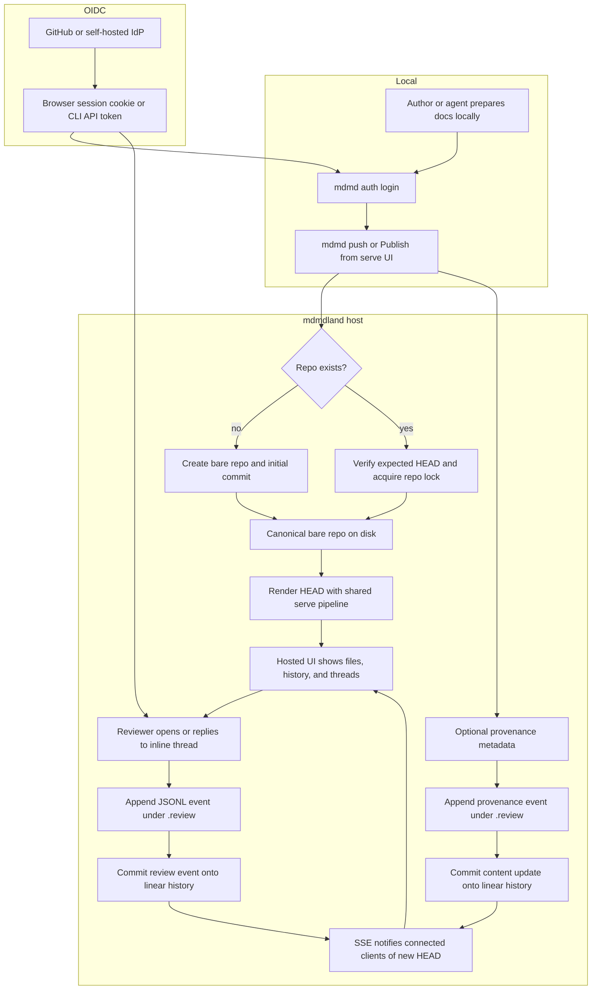

# mdmdland

## Overview

`mdmdland` should be a hosted companion to `mdmd`: a gist-like place for one or more Markdown-first files, backed by a real Git repo with exactly one linear history. The hosted service is where sharing, inline comments, provenance, and realtime collaboration live; the local CLI and `serve` UI remain first-class for authoring, browsing, and pushing updates.

The source of truth is the repo itself:

- user-authored files live at normal paths
- comments and review state live under `.review/`
- agent provenance also lives under `.review/`
- every mutation appends one new commit to the same linear history
- plain `git clone` must yield the full artifact and collaboration context
- no source-of-truth database is required; caches may exist, but must be disposable and rebuildable from repo contents

Recommended implementation shape:

- Add a second binary, `mdmdland`, for the hosted multi-user service.
- Keep the existing `mdmd` binary for TUI, local `serve`, auth, and publish/push flows.
- Reuse the existing `serve` rendering pipeline and assets so hosted rendering matches local rendering.
- Start with a second binary plus shared library modules in the current Cargo package. Do not begin with a full workspace split unless reuse pressure proves it necessary.
- Store canonical hosted repos as bare repos on disk; use short-lived checkouts/worktrees for mutation and rendering work.
- Expose real Git clone/fetch access over smart HTTP or another standard Git transport. Do not replace clone with a proprietary export endpoint.

What Draft A got right and this plan keeps:

- strong local-first workflow boundaries
- comments, provenance, and content sharing the same linear history
- SSE as the default realtime mechanism
- a clear agent workflow, not just a human review workflow
- keeping `serve` and hosted rendering visually aligned

What Draft B got right and this plan keeps:

- bare-repo canonical storage with ephemeral working copies
- deterministic auth verification through a self-hosted OIDC provider
- concrete API/route shape, commit semantics, and concurrency controls
- explicit Chrome MCP verification checkpoints
- grounding the plan in the existing `serve` renderer and web assets

Non-goals for v1:

- branches, merges, PRs, or stacked changes
- in-browser collaborative editing of Markdown content
- multi-writer merge resolution beyond optimistic single-head append
- rich realtime presence beyond basic “new commit / thread updated” fanout

## Workflow Diagram



## Architecture

### Binary and module layout

The minimal practical path for this repo is:

- keep `src/main.rs` as the existing `mdmd` binary
- add `src/bin/mdmdland.rs` as the hosted service binary
- introduce `src/lib.rs` and move shared web-rendering code behind library modules both binaries can call

That keeps the change focused and aligned with the current single-package layout. If the service and CLI later diverge enough, shared modules can be promoted into a dedicated crate, but that should be a follow-on refactor, not the starting point.

Shared code to centralize early:

- Markdown-to-HTML rendering and page shell helpers from the current `serve` path
- shared web assets and asset hashing/versioning
- review/provenance schema types and JSONL parsing
- anchor extraction and reattachment logic
- auth/session abstractions

### Hosted repo storage

Each hosted document set is one bare Git repo under a configured data root:

```text
DATA_ROOT/
  <repo-id>.git/
```

Operational model:

- the bare repo is canonical
- writes materialize a short-lived checkout/worktree, apply the mutation, create one commit, then tear the checkout down
- reads render from an ephemeral checkout or a disposable HEAD cache keyed by commit ID
- any cache is derived state and may be blown away and rebuilt from the repo

This is safer than a permanently checked-out worktree and keeps concurrent mutation logic simpler.

### Linear-history enforcement

Every mutating operation must provide an expected head:

- CLI push includes the last known hosted commit
- web mutations use the page’s current head or an ETag-style value
- the server acquires a per-repo lock, verifies the expected head still matches, commits, then releases the lock
- head mismatch returns a conflict so the client can refetch and retry

This preserves the product model: one line of history, no hidden branching.

### Git transport

`mdmdland` is not only an HTML/API app. It must also make the canonical repo cloneable through standard Git tooling. The plan should treat that as a first-class deliverable, not a nice-to-have:

- support authenticated read access for clone/fetch
- keep repo history and `.review/` data visible in normal Git history
- ensure the hosted UI/API is layered on top of the same repo, not a parallel store

## Repo Layout and Event Model

Recommended layout at `HEAD`:

```text
README.md
spec.md
api.md
assets/diagram.png

.review/
  events.jsonl
  provenance.jsonl
  snapshots/
```

Rules:

- content files remain ordinary files at ordinary paths
- `.review/events.jsonl` is the append-only event log for comment and thread state
- `.review/provenance.jsonl` is the append-only event log for agent provenance
- `.review/snapshots/` is optional repair/debug support for difficult reattachment cases; it is not a second source of truth

### Review event schema

Each event should be self-contained enough to replay thread state from scratch:

- `event_id`
- `thread_id`
- `kind`
- `actor_id`
- `timestamp`
- `path`
- `anchor`
- `body`
- `commit`
- `in_reply_to` when relevant
- optional metadata for edit history, resolution reason, or system actions

Useful kinds for v1:

- `thread.opened`
- `comment.added`
- `comment.edited`
- `thread.resolved`
- `thread.reopened`

### Provenance event schema

Each provenance line should capture the minimum needed to audit and replay an agent-assisted change:

- `run_id`
- `actor_id`
- `model`
- `prompt_ref` and/or `prompt_hash`
- `input_commit`
- `output_commit`
- `addressed_threads`
- `tool_summary`
- `verification_refs`
- `timestamp`

### Commit conventions

Every content edit, review action, and provenance write advances history by one commit. Keep commit messages regular enough to scan:

- `content: update spec.md api.md`
- `review: open thread on spec.md`
- `review: reply thr_...`
- `review: resolve thr_...`
- `agent: address thr_...`

Commit authorship should derive from the authenticated actor identity, with a system actor reserved for explicit system-generated repair or migration commits.

## Comment Anchors and Reattachment

Draft B was right to avoid line numbers as the primary anchor. Draft A was right that a single anchor style is not enough. The best v1 design is a compound anchor recorded when a thread is opened:

- `path`
- `heading_path`
- `block_key` derived from the rendered/parsed block
- selected `quote`
- optional `quote_prefix` / `quote_suffix`
- `line_hint`

To support that cleanly, the shared renderer should emit stable block metadata in hosted mode without changing visible output, for example:

- per-block `data-block-key`
- per-block source path metadata
- preserved heading IDs from the existing renderer

Reattachment algorithm on a new `HEAD`:

1. parse the new Markdown into blocks with heading ancestry
2. try exact `block_key` match in the same path
3. try `heading_path` + `quote` match
4. try nearby `quote_prefix` / `quote_suffix` match
5. fall back to bounded `line_hint`
6. if multiple candidates remain or no candidate is trustworthy, mark the thread orphaned and surface it explicitly instead of silently moving it

This gives the system a real chance to survive edits without pretending reattachment is magically perfect.

## Auth and Identity

Authentication should use an OIDC abstraction with two providers from the start:

- GitHub for production-facing login
- a self-hosted OIDC provider for local development, CI, and verification

The self-hosted provider should be the primary automated-test path. It can run as a dev-only mode of `mdmdland` or a small companion process, but it must be deterministic and easy to boot in tests.

Identity model:

- browser UI uses signed `HttpOnly` session cookies
- CLI uses a browser-assisted login flow and stores an API token per host in config
- actors are written into review/provenance logs as stable IDs such as `github:alice` or `oidc-dev:reviewer1`

Because browser automation is required, plan the auth flow around stable HTTPS callback URLs. When running inside exe.dev, use the documented HTTPS proxy for the hosted service and the dev IdP rather than relying on undocumented local endpoints.

## UI, API, and CLI Surface

### Hosted UI

The hosted UI should reuse the same rendering and styling path as `mdmd serve`, then layer collaboration features on top:

- rendered Markdown view
- raw file view
- multi-file navigation
- inline comment markers and thread sidebar/panel
- linear history view with content/review/provenance filtering
- resolve/reopen actions

Keep authored-content editing out of the hosted UI in v1. Content changes happen locally, then get pushed.

### Realtime

Use SSE first, not WebSockets:

- mutations are ordinary HTTP requests
- the server broadcasts lightweight repo events after each successful commit
- clients refetch thread or file state as needed
- reconnect behavior can key off the last seen commit ID rather than a database-backed event stream

Suggested event types:

- `repo.updated`
- `thread.updated`
- `thread.orphaned`

### JSON API

Keep the API narrow and repo-native:

- create repo
- push content snapshot
- list files / fetch rendered file / fetch raw file
- list threads
- open thread
- add reply
- resolve thread
- reopen thread
- list provenance

For pushes, send:

- selected files relative to a common root
- repo slug or ID
- expected head
- optional commit message
- optional provenance metadata

### CLI and `serve` integration

Recommended CLI surface:

- `mdmd auth login --host <url> [--provider github|dev]`
- `mdmd auth logout --host <url>`
- `mdmd push <paths...> --to <url> [--repo <slug>] [--expected-head <sha>]`
- `mdmd pull <repo> --from <url>`
- `mdmd threads <repo> --host <url> [--status open|resolved|all]`

Recommended `serve` additions:

- authenticated `Publish` / `Update hosted copy` button
- link to the hosted repo after publish
- optional badge showing open hosted thread count for the current doc set

`serve` should remain a local viewer with publish affordances, not become a second hosted app.

## Concurrency, Materialization, and Thread State

The repo stays canonical; thread state is materialized from `.review/events.jsonl` on demand or via disposable caches.

Concurrency model:

- per-repo filesystem lock for all writes
- lock-free reads against the current head snapshot
- in-memory broadcast channel per repo for SSE fanout

That is enough for v1 because writes are short and linear by design.

## Delivery Plan

### Phase 1: Shared foundation and read-only hosting

- add the `mdmdland` binary
- extract shared rendering/page-shell code behind `src/lib.rs`
- implement canonical bare-repo storage and repo creation
- render hosted files using the same pipeline/assets as `serve`
- add multi-file navigation and a simple history view
- make clone/fetch part of the design from the start, not a later afterthought

Exit criteria:

- a multi-file doc set can be published and viewed through `mdmdland`
- hosted render output visibly matches `mdmd serve`
- the repo can be cloned with standard Git tooling

### Phase 2: Auth and publish flows

- add the OIDC abstraction
- wire the self-hosted dev IdP first
- add GitHub login second
- add browser session handling and CLI token storage
- add `mdmd auth` and `mdmd push`
- add `serve` publish/update affordances

Exit criteria:

- login works end-to-end against the self-hosted IdP
- CLI and `serve` can publish/update authenticated repos
- conflict handling on stale `expected_head` is in place

### Phase 3: Review events, anchors, and realtime

- add `.review/events.jsonl`
- add inline thread open/reply/resolve/reopen flows
- emit stable block metadata from the renderer
- implement compound anchors and reattachment
- add SSE-based repo/thread updates

Exit criteria:

- two viewers see comment activity update in near realtime
- thread anchors survive common document edits
- orphaned threads are surfaced explicitly when repair is ambiguous

### Phase 4: Provenance and agent workflows

- add `.review/provenance.jsonl`
- allow pushes to include addressed-thread mappings and agent metadata
- add CLI/API endpoints for listing open threads and provenance
- show provenance and addressed-thread info in hosted history views

Exit criteria:

- an agent can fetch open threads, update docs locally, push a new revision, and record what it intended to address
- reviewers can inspect the resulting content, thread state, and provenance in one repo timeline

## Verification

Chrome MCP must be part of verification, not a final spot check. Use it at each phase against the self-hosted IdP and a deterministic multi-file fixture repo.

### Automated coverage

- unit tests for JSONL parsing, anchor extraction, reattachment, and session/token handling
- integration tests for repo creation, push, conflict handling, render parity, comment lifecycle, and SSE delivery
- fixture-based tests that replay thread state from `.review/events.jsonl`

### Chrome MCP checkpoints

1. Auth:
   - log in through the self-hosted IdP
   - verify session establishment and logged-in UI state
2. Publish:
   - publish a multi-file repo from `serve`
   - publish/update the same repo from the CLI
   - verify the hosted page renders the same document structure as local `serve`
3. Comments:
   - open a thread on a rendered block
   - add a reply from a second browser session
   - verify SSE updates both tabs
   - resolve and reopen the thread
4. Edit + reattach:
   - push a content revision that moves text under the same heading
   - verify the thread reattaches correctly
   - push a revision that makes the anchor ambiguous and verify the thread is marked orphaned
5. Agent flow:
   - push a provenance-bearing update that claims specific addressed threads
   - verify the provenance view and thread/history linkage

When those flows need HTTPS callback URLs in exe.dev, route them through the documented exe.dev proxy so Chrome MCP is exercising the supported environment.

## Open Questions

- default visibility model: public-read, unlisted-read, or authenticated-read-only by default
- slug strategy: human-readable slug, opaque ID, or both
- whether hosted “small fix” editing belongs in v1 or stays fully local-only
- quota limits for repo size, file count, and event volume
- whether the self-hosted dev IdP should be embedded in `mdmdland` or shipped as a tiny companion binary
