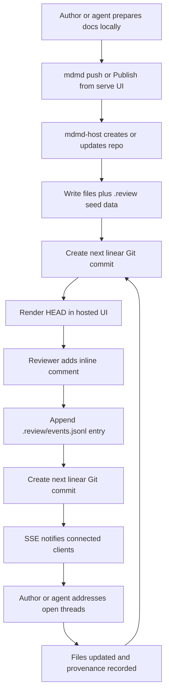

# mdmdland Draft A

## Overview

`mdmdland` should be a hosted companion to `mdmd`, not a replacement for the local CLI.

Recommended shape:
- Keep `mdmd` as the local CLI, local `serve` renderer, and publish client.
- Add a second binary in this repo, `mdmd-host` (name provisional), that runs the hosted multi-user service.
- Reuse the existing `serve` rendering pipeline so local and hosted document views stay visually aligned.

Product goals:
- Hosted, gist-like sharing for one or more Markdown-first files.
- Each shared item is a small Git repo with exactly one linear history.
- `HEAD` is always the canonical current state.
- Content edits, comment actions, and provenance events all advance that same single timeline.
- `git clone` remains a complete export format for files, comments, provenance, and history.
- No source-of-truth database for repo state; any cache must be disposable and rebuildable from repo contents.

Non-goals for v1:
- Branches, merges, pull requests, or stacked changes.
- General-purpose collaborative rich text editing.
- Multi-writer conflict resolution beyond single-head optimistic append rules.

## Recommended Shape

### Binary split

- `mdmd`: existing CLI, local viewer, local `serve`, plus new publish/auth commands.
- `mdmd-host`: hosted service for auth, repo storage, comment/provenance commits, and realtime fanout.
- Shared library modules: repo model, review event schema, renderer, anchor resolver, and auth abstractions.

Rationale:
- Keeps local workflows lightweight.
- Lets hosted-service deployment concerns evolve independently from the CLI.
- Avoids turning `serve` into a multi-tenant application server.

### Deployment model

- The host service stores repos on local disk or a mounted persistent volume under a configured root.
- Each hosted document set is one Git repo addressed by a stable slug or opaque ID.
- The service keeps a checked-out worktree for rendering `HEAD` and creating the next commit.
- Derived caches are allowed for performance, but the repo remains the source of truth.

## Repo Model

Proposed on-disk layout inside each hosted repo:

```text
README.md
spec.md
assets/diagram.png

.review/
  events.jsonl
  provenance.jsonl
  anchors/
  snapshots/
```

Rules:
- User-authored files live at normal repo paths.
- `.review/events.jsonl` stores thread, reply, resolve, reopen, edit, and system events.
- `.review/provenance.jsonl` stores agent runs, prompt/ref hashes, model IDs, tool metadata, and addressed thread IDs.
- `.review/snapshots/` stores optional anchor-repair snapshots for difficult reattachment cases.
- Every logical action is append-only at the JSONL layer and then committed as the next Git commit.

## Data Model

Comment event schema should include:
- `event_id`, `thread_id`, `repo_id`, `commit`, `actor`, `timestamp`
- `kind`: `thread.opened`, `comment.added`, `thread.resolved`, `thread.reopened`, `comment.edited`
- `path`
- anchor payload:
  - semantic block ID when available
  - heading path or AST path
  - quoted text
  - start/end line fallback
- optional parent event and reference IDs

Provenance event schema should include:
- `run_id`, `actor`, `model`, `prompt_ref`, `input_commit`, `output_commit`
- `addressed_threads`
- `tool_summary`
- `verification_refs`

Anchor strategy:
- Use AST-derived block anchors first.
- Store quoted text and line span as repair hints.
- On new commits, reattach threads by semantic block match, then quote match, then bounded line-delta fallback.
- When repair is ambiguous, mark the thread as needing manual reattachment instead of silently moving it.

## API and Auth

Primary interfaces:
- HTML pages for reading, rendering, and commenting
- JSON API for CLI and frontend mutations
- SSE streams for repo timeline, thread updates, and light presence notifications

Auth:
- Implement an OIDC abstraction with at least two providers:
  - GitHub OAuth or OIDC for production-friendly login
  - a self-hosted OIDC provider for development, testing, and verification
- Prefer the self-hosted provider for local and CI verification so auth flows stay deterministic and do not depend on GitHub availability.
- Map authenticated identities to stable actor records written into review and provenance events.

Recommendation:
- Start with SSE, not WebSockets.
- Most realtime needs are server-to-client fanout of newly committed events.
- Writes can stay normal HTTP POST or PUT requests.
- Revisit WebSockets only if live cursors, typing indicators, or collaborative editing become requirements.

## UX and Workflow

### Create and publish

- A local author selects one or more files in the CLI or `serve` UI and publishes them to the hosted service.
- The CLI should add a command in the `publish` or `push` family, for example `mdmd push <paths...> --host <url>`.
- The `serve` UI should expose the same action through an authenticated publish flow.
- Initial publish creates a hosted repo, uploads the working tree snapshot, and records an initial provenance event when the content came from an agent flow.

### Review and iterate

- The hosted page renders Markdown using the same server-side renderer and styling path as `mdmd serve`.
- Reviewers add inline comments against rendered blocks or raw-source views.
- Each comment action appends JSONL event data under `.review/` and creates the next linear commit.
- Authors or agents update files locally or through a later hosted-edit flow, then push a new commit.
- Existing threads reattach across revisions and can be resolved or reopened.

### Clone and inspect

- Authorized users can clone the repo directly.
- Local users can inspect history with Git tools or `jj`, but the product model remains a single Git line of commits.
- Content-only, review-only, and full-history views are all projections over the same repo.

## Workflow Diagram



## System Components

1. Shared renderer and anchors
- Extract the current `serve` HTML rendering pipeline into reusable library code.
- Add stable block IDs and source-mapping hooks needed for inline comment anchoring.

2. Hosted repo manager
- Create or open repos by slug.
- Enforce single-head linear append semantics.
- Serialize mutations with per-repo locking so concurrent writers cannot fork history.

3. Review event engine
- Append comment and provenance JSONL entries.
- Materialize thread state from event history.
- Reattach anchors on each new `HEAD`.

4. Hosted web app
- Read view: rendered Markdown, raw file toggle, thread sidebar, history view.
- Write view: comment composer, resolve/reopen actions, and publish/update controls.
- Realtime updates via SSE.

5. Auth and session layer
- OIDC login, callback handling, and signed session cookies or equivalent.
- Provider configuration for GitHub and the self-hosted test IdP.

## CLI and `serve` Integration

CLI additions:
- `mdmd push <paths...> --host <url> [--repo <slug>]`
- `mdmd pull <repo>`
- `mdmd auth login --host <url>`
- `mdmd review apply --repo <slug>` for later agent or human workflows driven by open threads

`serve` additions:
- Authenticated "Publish" or "Update Hosted Copy" action when viewing local docs
- Link from the local `serve` page to the hosted URL after publish
- Optional sidebar showing publish state and open hosted threads for the current document set

Implementation note:
- The local and hosted UIs should share renderer templates where practical, with hosted mode layering auth, comments, history, and realtime on top.

## Phased Delivery

### Phase 1: Core hosted repo and rendering parity

- Add the `mdmd-host` binary.
- Support create, view, and clone for hosted repos.
- Reuse the `serve` renderer for hosted read-only pages.
- Land repo layout and JSONL schemas under `.review/`.

### Phase 2: Comments and realtime

- Add inline threads, replies, resolve, and reopen.
- Commit each review action onto the linear history.
- Add SSE timeline updates and thread refresh in the hosted UI.

### Phase 3: Auth and publish flows

- Add the OIDC provider abstraction.
- Wire GitHub auth and self-hosted IdP auth.
- Add `mdmd push` plus authenticated publish/update from the `serve` UI.

### Phase 4: Agent provenance and automation

- Add provenance event creation for agent-authored changes.
- Map new commits to addressed threads.
- Add agent-oriented CLI flows for fetching open threads and publishing revised docs.

## Verification Strategy

Automated:
- Unit tests for anchor matching, reattachment, JSONL event parsing, linear append enforcement, and auth configuration handling
- Integration tests for publish, clone, comment, resolve/reopen, and SSE event delivery
- End-to-end tests against a self-hosted OIDC provider running in development and CI
- Renderer parity tests comparing local `serve` output to hosted output for the same input repo

Manual and browser verification:
- Use Chrome MCP for end-to-end verification of login, publish, inline comments, realtime updates, and thread resolution flows.
- Make the self-hosted IdP the primary verification path so the browser test environment is fully controlled.
- Keep a small canned multi-file fixture repo for deterministic browser verification.

## Open Questions

- Final service binary name: `mdmd-host`, `mdmdland`, or another product-facing name
- Whether anonymous read access is supported in v1 or all repos require auth
- Whether hosted Markdown edits are in scope for v1, or only local-edit plus push
- Whether repo IDs should be human-readable slugs, opaque IDs, or both
