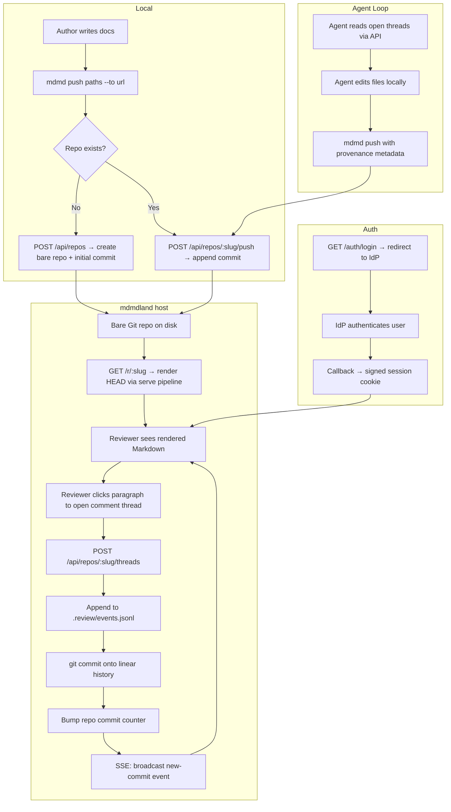

# mdmdland Draft B

## Overview

mdmdland is a Git-backed hosting service for sharing and collaborating on Markdown documents, built as a companion binary (`mdmdland`) in the mdmd workspace. The core insight: every piece of state—files, comments, provenance, history—lives in a bare Git repo with a single linear commit chain. There is no database. The repo *is* the database.

The system reuses the existing `serve` rendering pipeline (comrak + `html.rs` + `mdmd.css` + `mdmd.js`) so hosted documents look identical to local ones, then layers on three new capabilities: inline comment threads, OIDC authentication, and SSE-driven realtime updates.

Key architectural decisions in this draft:

- **Bare repos with ephemeral checkouts**: The host stores bare Git repos. Working trees are materialized on demand into a temp directory, used for the duration of a mutation, then discarded. This avoids stale worktree state and simplifies concurrent access.
- **Auth-first phasing**: Authentication and session management come before comments, because every mutation (including commenting) requires a verified actor identity. The self-hosted OIDC provider is the primary development and CI path.
- **SSE over the commit log**: Each repo maintains a commit counter. Clients subscribe to `GET /r/{slug}/events` and receive new-commit notifications. The client then fetches the updated thread state and re-renders affected regions. No per-field diffing or CRDT machinery.
- **Comment anchors are heading-path + quote pairs**: Instead of line numbers or AST node indices, anchors use the heading hierarchy path (e.g., `["Overview", "Deployment model"]`) plus a quoted text snippet. This survives most edits because headings are the most stable structural elements in Markdown. Line spans are stored as a fallback hint, not as the primary anchor.

Non-goals for v1:
- In-browser document editing (content changes happen locally and are pushed)
- Branches, forks, or merge workflows
- Multi-writer conflict resolution (single-head optimistic locking)
- Syntax highlighting in code blocks beyond what comrak provides

## Workflow Diagram



## Workspace Layout

Add `mdmdland` as a second binary target in the existing Cargo workspace. Extract shared rendering code into a library crate.

```
Cargo.toml              (workspace root)
crates/
  mdmd-core/            (new library crate)
    src/
      lib.rs
      html.rs           (moved from src/html.rs)
      render.rs          (serve rendering helpers, extracted)
      backlinks.rs       (moved from src/backlinks.rs)
      review/
        mod.rs           (review event types + JSONL parsing)
        anchors.rs       (heading-path anchor resolution)
        threads.rs       (thread state materialization)
      auth/
        mod.rs           (OIDC trait + session types)
        github.rs        (GitHub OIDC provider)
        selfhosted.rs    (dev/test OIDC provider)
  mdmd/                  (existing CLI binary, depends on mdmd-core)
    src/
      main.rs
      serve.rs
      parse.rs
      web_assets.rs
      assets/
  mdmdland/              (new hosted service binary, depends on mdmd-core)
    src/
      main.rs            (CLI: config, bind, run)
      app.rs             (Axum router + state)
      routes/
        pages.rs         (HTML page handlers)
        api.rs           (JSON API handlers)
        auth.rs          (OIDC login/callback/logout)
        sse.rs           (SSE event stream)
      repo.rs            (bare repo management, commit, checkout)
      templates.rs       (page shell: wraps core renderer output)
      assets/
        land.css         (comment UI, auth chrome, additions to mdmd.css)
        land.js          (comment interactions, SSE client, auth flows)
```

## Repo Model

Each hosted document set is a bare Git repo under `{DATA_ROOT}/{slug}.git/`.

On-disk layout inside the repo (visible at HEAD):

```
README.md
spec.md
assets/diagram.png

.review/
  events.jsonl        # all comment/thread events
  provenance.jsonl    # agent run metadata
```

### Event Schema (`.review/events.jsonl`)

Each line is a self-contained JSON object:

```json
{
  "id": "evt_01J...",
  "thread_id": "thr_01J...",
  "kind": "thread.opened",
  "actor": "github:exedev",
  "timestamp": "2026-03-08T12:00:00Z",
  "path": "spec.md",
  "anchor": {
    "heading_path": ["API Design", "Authentication"],
    "quote": "tokens should be rotated every 24 hours",
    "line_hint": [42, 42]
  },
  "body": "Should we make the rotation interval configurable?",
  "commit": "abc123"
}
```

Event kinds: `thread.opened`, `comment.added`, `comment.edited`, `thread.resolved`, `thread.reopened`, `thread.deleted`.

### Provenance Schema (`.review/provenance.jsonl`)

```json
{
  "run_id": "run_01J...",
  "actor": "agent:claude-opus",
  "model": "claude-opus-4-6",
  "input_commit": "abc123",
  "output_commit": "def456",
  "prompt_hash": "sha256:...",
  "addressed_threads": ["thr_01J..."],
  "timestamp": "2026-03-08T12:05:00Z"
}
```

### Commit Semantics

Every mutation is a single Git commit on the linear history:
- Content push: commit message `content: update {paths}`
- Thread opened: commit message `review: open thread on {path}`
- Comment added: commit message `review: comment on {thread_id}`
- Thread resolved: commit message `review: resolve {thread_id}`
- Agent update: commit message `agent: update {paths} (addressing {thread_ids})`

Commit author is set from the authenticated actor identity.

## Authentication

### OIDC Abstraction

A trait-based provider interface:

```rust
#[async_trait]
trait OidcProvider: Send + Sync {
    fn authorization_url(&self, state: &str, nonce: &str) -> Url;
    async fn exchange_code(&self, code: &str) -> Result<TokenResponse>;
    async fn userinfo(&self, access_token: &str) -> Result<UserInfo>;
    fn provider_name(&self) -> &str;
}
```

Two implementations:
1. **GitHub OIDC**: Standard OAuth2 authorization code flow against `github.com`.
2. **Self-hosted IdP**: A minimal OIDC-compliant server embedded in the `mdmdland` binary behind a `--dev-idp` flag. Issues real JWTs, supports configurable test users, runs on a separate port. This is the primary path for automated testing and Chrome MCP verification.

### Session Management

- Login: `GET /auth/login?provider={github|dev}` → redirect to IdP
- Callback: `GET /auth/callback` → exchange code, set signed `HttpOnly` cookie
- Session cookie: HMAC-signed, contains actor ID and expiry
- API auth: Same cookie, or `Authorization: Bearer {token}` for CLI

## API Surface

### Pages (HTML, require auth for write actions)

| Route | Description |
|-------|-------------|
| `GET /` | Landing page: recent repos, create new |
| `GET /r/{slug}` | Repo view: rendered README or file listing |
| `GET /r/{slug}/{path}` | Render specific file with comment threads |
| `GET /r/{slug}/{path}?raw=1` | Raw file content |
| `GET /r/{slug}/history` | Linear commit log |
| `GET /auth/login` | Redirect to OIDC provider |
| `GET /auth/callback` | OIDC callback |
| `POST /auth/logout` | Clear session |

### API (JSON, all require auth)

| Route | Method | Description |
|-------|--------|-------------|
| `/api/repos` | POST | Create new repo |
| `/api/repos/{slug}/push` | POST | Push file updates (multipart) |
| `/api/repos/{slug}/threads` | GET | List threads for repo |
| `/api/repos/{slug}/threads` | POST | Open new thread |
| `/api/repos/{slug}/threads/{id}/comments` | POST | Add comment |
| `/api/repos/{slug}/threads/{id}/resolve` | POST | Resolve thread |
| `/api/repos/{slug}/threads/{id}/reopen` | POST | Reopen thread |
| `/api/repos/{slug}/clone` | GET | Git clone URL + instructions |

### SSE

| Route | Description |
|-------|-------------|
| `GET /r/{slug}/events` | SSE stream: `new-commit`, `thread-update`, `presence` events |

SSE event format:

```
event: new-commit
data: {"commit":"def456","summary":"review: open thread on spec.md","actor":"github:reviewer","timestamp":"..."}

event: thread-update
data: {"thread_id":"thr_01J...","kind":"comment.added","path":"spec.md"}
```

Clients receive these events and refetch affected thread data or re-render changed content regions. This keeps the SSE payload small and avoids sending full comment bodies over the stream.

## Comment Anchoring

### Anchor Resolution Algorithm

When rendering a file with threads:

1. Parse the Markdown AST via comrak.
2. Walk the AST to build a heading-path index: each block gets the heading path of its nearest ancestor headings.
3. For each thread anchor:
   a. Match by `heading_path` — find the heading subtree.
   b. Within that subtree, search for a paragraph containing `quote` text.
   c. If quote not found, fall back to `line_hint` with a ±5 line tolerance.
   d. If nothing matches, mark the thread as "orphaned" and display it in a sidebar.
4. Attach resolved anchors to the rendered HTML as `data-thread-id` attributes on the containing block element.

### Reattachment on New Commits

When a content push creates a new HEAD:
1. Diff the old and new ASTs.
2. For each active thread, re-run the anchor resolution against the new content.
3. If the heading path still exists and the quote is found, the anchor is stable.
4. If the quote moved to a different heading subtree, update the anchor's `heading_path`.
5. If resolution fails, mark the thread as needing manual reattachment. Do not silently move it.

## Rendering Integration

The hosted page reuses the core rendering pipeline:

1. Checkout HEAD of the bare repo into a temp directory.
2. Call `mdmd_core::html::render_markdown()` on the target file.
3. Call `mdmd_core::html::build_page_shell()` to wrap in the standard page structure (TOC sidebar, theme toggle, indent hierarchy).
4. Inject additional hosted-mode HTML:
   - Auth header bar (user avatar, logout)
   - Comment thread markers on anchored blocks
   - Comment sidebar/panel
   - SSE connection script
5. Serve the composed page with `land.css` and `land.js` layered on top of `mdmd.css` and `mdmd.js`.

This ensures visual parity: a document looks the same locally and hosted, with the hosted version adding a collaboration layer on top.

## CLI Integration

New subcommands on the existing `mdmd` binary:

```
mdmd push <paths...> --to <host-url> [--repo <slug>] [--message <msg>]
mdmd pull <slug> --from <host-url> [--output <dir>]
mdmd auth login --host <host-url> [--provider github|dev]
mdmd auth logout --host <host-url>
mdmd threads <slug> --host <host-url> [--status open|resolved|all]
```

The `serve` UI adds:
- A "Publish to mdmdland" button in the top-right button group (next to theme/indent toggles)
- After publishing, a link to the hosted URL
- An optional badge showing open thread count for the hosted copy

Credential storage: auth tokens stored in `~/.config/mdmd/hosts.toml`:

```toml
[hosts."land.example.com"]
token = "..."
provider = "github"
actor = "github:exedev"
```

## Concurrency Model

- Each bare repo has a filesystem-level lock file (`{slug}.git/mdmdland.lock`).
- Mutations (push, comment, resolve) acquire the lock, perform the Git operation, bump the commit counter, release the lock.
- Reads (render, list threads) do not acquire the lock; they read from the bare repo at the current HEAD.
- SSE fanout uses a per-repo `tokio::sync::broadcast` channel. The mutation path sends to the channel after committing.
- Multiple concurrent readers are fine. Concurrent writers serialize through the lock. This is acceptable because write operations (appending a JSONL line and committing) are fast (<50ms).

## Phased Delivery

### Phase 1: Skeleton and Auth

- Create `crates/mdmdland/` binary with Axum router.
- Extract `html.rs` and `backlinks.rs` into `crates/mdmd-core/`.
- Implement the OIDC abstraction with the self-hosted dev IdP.
- Implement session cookies and the auth routes.
- Landing page with login flow.
- Verify auth end-to-end with Chrome MCP against the dev IdP.

### Phase 2: Repo Management and Rendering

- Implement bare repo creation, file push, and HEAD rendering.
- Reuse the core rendering pipeline for hosted pages.
- Add `mdmd push` and `mdmd auth` CLI commands.
- Directory listing and file navigation for multi-file repos.
- History view (linear commit log).
- Verify rendering parity between local `serve` and hosted view via Chrome MCP.

### Phase 3: Comments and Realtime

- Implement thread/comment JSONL event schema and append logic.
- Add comment UI: click-to-comment on rendered blocks, thread sidebar.
- Wire SSE for realtime thread updates.
- Implement anchor resolution and reattachment.
- Thread resolve/reopen flows.
- Verify full comment lifecycle with Chrome MCP.

### Phase 4: GitHub Auth and Agent Workflows

- Add GitHub OIDC provider.
- Add provenance event schema and agent metadata recording.
- Add `mdmd threads` CLI command for agent consumption.
- Agent loop: read threads → edit files → push with provenance.
- `serve` UI publish button and thread badge.

## Verification Strategy

### Self-hosted IdP as primary test path

The embedded dev IdP (`--dev-idp` flag) is the authoritative verification environment:
- Deterministic credentials (configurable test users)
- No external dependencies
- Works in CI without secrets
- Chrome MCP tests authenticate against it directly

### Chrome MCP verification checkpoints

Each phase includes specific Chrome MCP verification steps:

1. **Auth**: Navigate to login, authenticate via dev IdP, verify session cookie, verify logged-in state on landing page.
2. **Rendering**: Push a multi-file fixture, navigate to hosted URL, compare rendered output to local `serve` output for the same files.
3. **Comments**: Open a thread on a specific paragraph, add a reply, verify SSE delivers the update to a second tab, resolve the thread, verify resolution state.
4. **Agent flow**: Push an agent-authored update with provenance, verify provenance display, verify thread addressed markers.

### Automated tests

- Unit: JSONL event parsing, anchor resolution, heading-path extraction, OIDC token validation, session cookie signing.
- Integration: Repo create/push/render cycle, comment append + commit, SSE event delivery, auth login/callback flow.
- Fixture repo: A canned multi-file repo with pre-existing threads for deterministic browser tests.

## Open Questions

- Repo visibility: should repos default to public-read or require auth for all access?
- Slug format: human-readable (`my-spec`) vs. short opaque (`a1b2c3`) vs. both (slug + ID)?
- Rate limiting strategy for comment creation (per-actor? per-repo?)
- Whether the dev IdP should support multiple configurable users or just a single test identity
- Maximum repo size limits and file count limits for hosted repos
