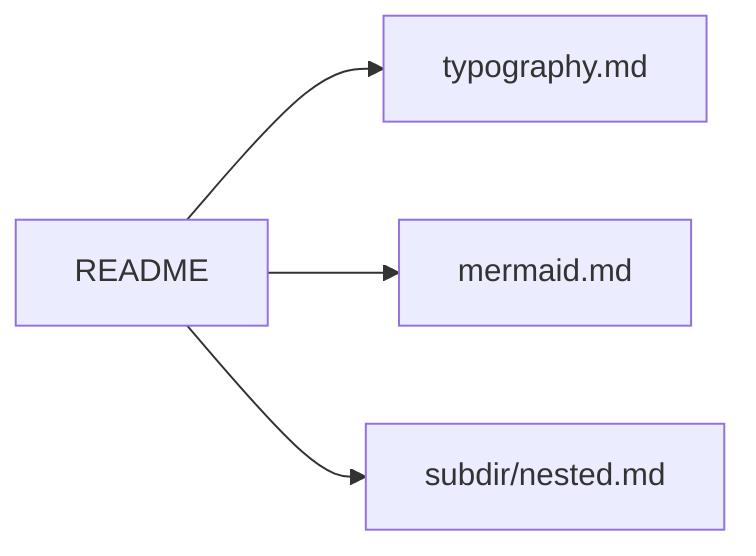

# mdmd Playground

A tour of features supported by `mdmd serve`. Click any link to navigate.

## Pages

- [Typography](typography.md) — headings, emphasis, blockquotes, lists
- [Tables](tables.md) — GFM tables of various shapes
- [Code](code.md) — fenced blocks with language highlighting hints
- [Tasks](tasks.md) — task lists and mixed lists
- [Mermaid](mermaid.md) — diagrams: flowchart, sequence, gantt, pie
- [Links](links.md) — local links, extensionless, external, fragments
- [Nested doc](subdir/nested.md) — a doc one level deep
- [Deep headings](deep-headings.md) — stress-test for indentation hierarchy (H3–H6, skipped levels, alternating depths)

## Quick Preview

### Inline formatting

**Bold**, *italic*, ~~strikethrough~~, `inline code`, and **_bold italic_**.

### A short table

| Feature        | Status |
|----------------|--------|
| Tables         | ✓      |
| Task lists     | ✓      |
| Mermaid        | ✓      |
| Syntax hints   | ✓      |
| Local links    | ✓      |

### A tiny diagram

### A task

- [x] Set up playground
- [ ] Explore all the pages
