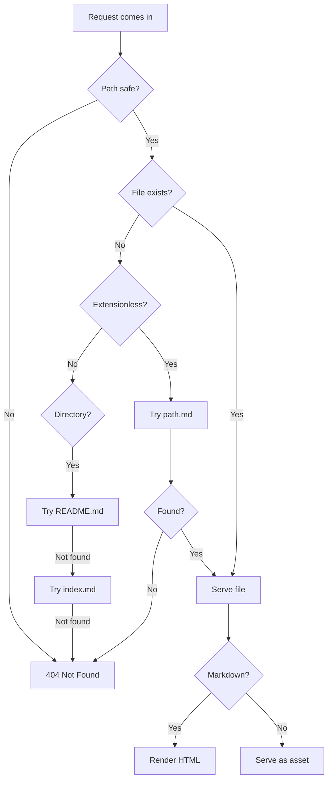
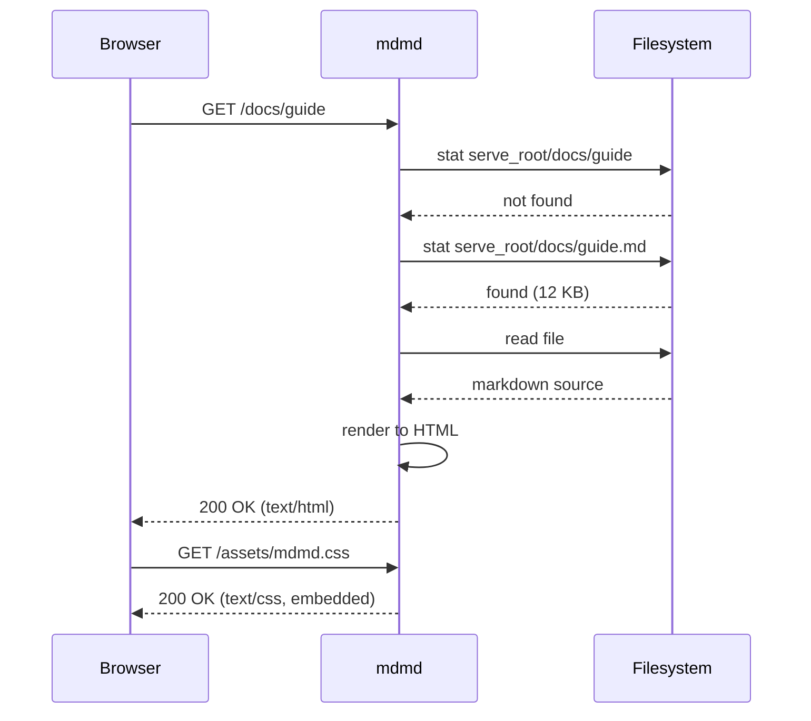
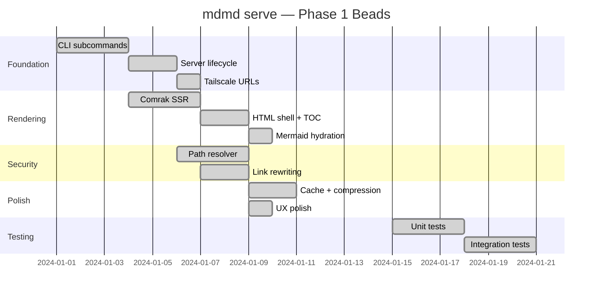
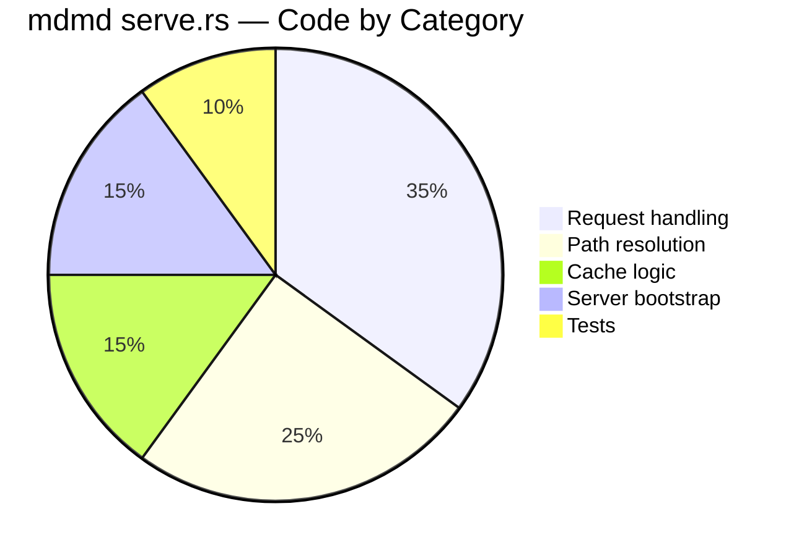
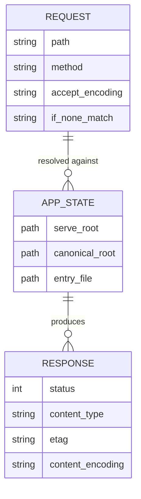
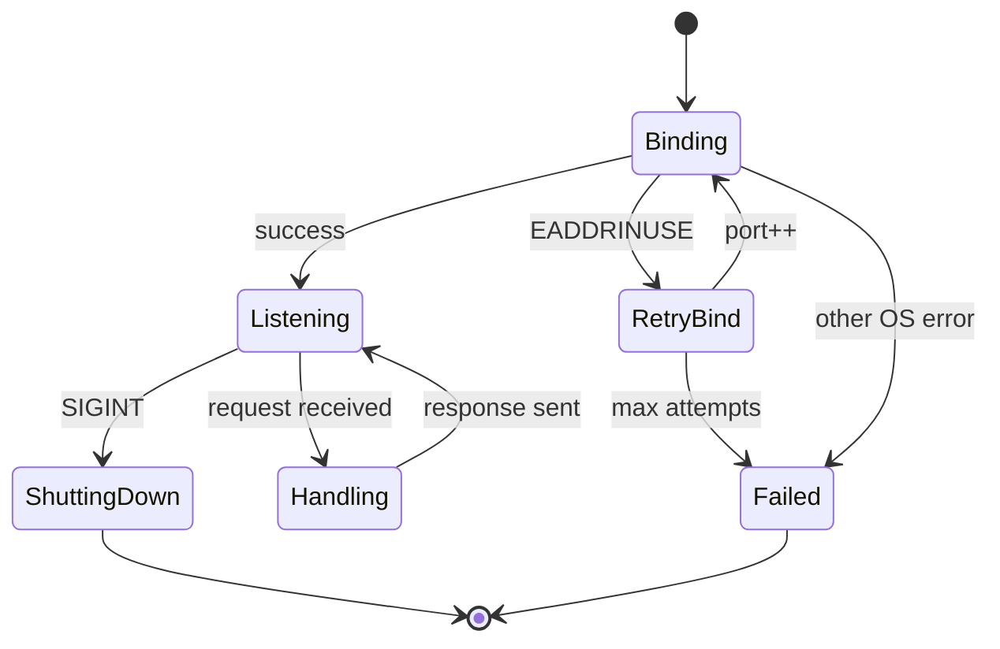

# Mermaid Diagrams

← [Back to index](README.md)

## Flowchart

```mermaid
flowchart TD
    A[Request comes in] --> B{Path safe?}
    B -->|No| C[404 Not Found]
    B -->|Yes| D{File exists?}
    D -->|No| E{Extensionless?}
    E -->|Yes| F[Try path.md]
    E -->|No| G{Directory?}
    G -->|Yes| H[Try README.md]
    H -->|Not found| I[Try index.md]
    I -->|Not found| C
    F --> J{Found?}
    J -->|No| C
    J -->|Yes| K[Serve file]
    D -->|Yes| K
    K --> L{Markdown?}
    L -->|Yes| M[Render HTML]
    L -->|No| N[Serve as asset]
```

## Sequence Diagram

```mermaid
sequenceDiagram
    participant Browser
    participant mdmd
    participant FS as Filesystem

    Browser->>mdmd: GET /docs/guide
    mdmd->>FS: stat serve_root/docs/guide
    FS-->>mdmd: not found
    mdmd->>FS: stat serve_root/docs/guide.md
    FS-->>mdmd: found (12 KB)
    mdmd->>FS: read file
    FS-->>mdmd: markdown source
    mdmd->>mdmd: render to HTML
    mdmd-->>Browser: 200 OK (text/html)
    Browser->>mdmd: GET /assets/mdmd.css
    mdmd-->>Browser: 200 OK (text/css, embedded)
```

## Gantt Chart

```mermaid
gantt
    title mdmd serve — Phase 1 Beads
    dateFormat  YYYY-MM-DD
    section Foundation
    CLI subcommands        :done, bd-p7i, 2024-01-01, 3d
    Server lifecycle       :done, bd-1mz, after bd-p7i, 2d
    Tailscale URLs         :done, bd-3kq, after bd-1mz, 1d
    section Rendering
    Comrak SSR             :done, bd-mzl, after bd-p7i, 3d
    HTML shell + TOC       :done, bd-2n4, after bd-mzl, 2d
    Mermaid hydration      :done, bd-2se, after bd-2n4, 1d
    section Security
    Path resolver          :done, bd-ezg, after bd-1mz, 3d
    Link rewriting         :done, bd-1p6, after bd-mzl, 2d
    section Polish
    Cache + compression    :done, bd-22o, after bd-ezg, 2d
    UX polish              :done, bd-30z, after bd-2n4, 1d
    section Testing
    Unit tests             :done, bd-2l9, 2024-01-15, 3d
    Integration tests      :done, bd-39z, after bd-2l9, 3d
```

## Pie Chart

```mermaid
pie title mdmd serve.rs — Code by Category
    "Request handling" : 35
    "Path resolution" : 25
    "Cache logic" : 15
    "Server bootstrap" : 15
    "Tests" : 10
```

## Entity Relationship

```mermaid
erDiagram
    REQUEST {
        string path
        string method
        string accept_encoding
        string if_none_match
    }
    APP_STATE {
        path serve_root
        path canonical_root
        path entry_file
    }
    RESPONSE {
        int status
        string content_type
        string etag
        string content_encoding
    }
    REQUEST ||--o{ APP_STATE : "resolved against"
    APP_STATE ||--o{ RESPONSE : "produces"
```

## State Diagram

```mermaid
stateDiagram-v2
    [*] --> Binding
    Binding --> Listening : success
    Binding --> RetryBind : EADDRINUSE
    RetryBind --> Binding : port++
    RetryBind --> Failed : max attempts
    Binding --> Failed : other OS error
    Listening --> Handling : request received
    Handling --> Listening : response sent
    Listening --> ShuttingDown : SIGINT
    ShuttingDown --> [*]
    Failed --> [*]
```
