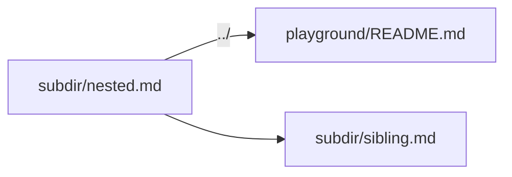

# Nested Document

← [Back to index](../README.md) | ← [Back to links](../links.md)

This page lives at `playground/subdir/nested.md`. Links back to the parent directory use `../`.

## Relative Links from a Subdirectory

- [README one level up](../README.md)
- [Mermaid page](../mermaid.md)
- [Tables page](../tables.md)
- [Another nested doc](sibling.md)

## This Page Has a TOC Too

Scroll down to see all the sections.

## A Table from Down Here

| Path              | Resolves to               |
|-------------------|---------------------------|
| `../README.md`    | `playground/README.md`    |
| `../mermaid.md`   | `playground/mermaid.md`   |
| `sibling.md`      | `playground/subdir/sibling.md` |

## A Diagram from a Subdirectory



## Code Still Works Here

```rust
fn greet(name: &str) -> String {
    format!("Hello, {name}!")
}
```

## Heading One
Lorem ipsum dolor sit amet.

## Heading Two
Consectetur adipiscing elit.

## Heading Three
Sed do eiusmod tempor.
