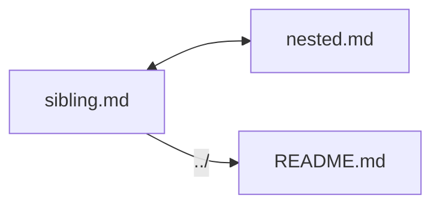

# Sibling Document

← [Back to nested](nested.md) | ← [Back to index](../README.md)

This page lives alongside `nested.md` in `playground/subdir/`. It exists to verify sibling links work correctly.

## Sibling Links

- [nested.md](nested.md) — same directory
- [Back to playground root](../README.md)
- [Mermaid](../mermaid.md)

## Content

Just enough content to make scrolling useful.

## Section A
Lorem ipsum dolor sit amet, consectetur adipiscing elit.

## Section B
Sed do eiusmod tempor incididunt ut labore et dolore magna aliqua.

## Section C
Ut enim ad minim veniam, quis nostrud exercitation ullamco.
